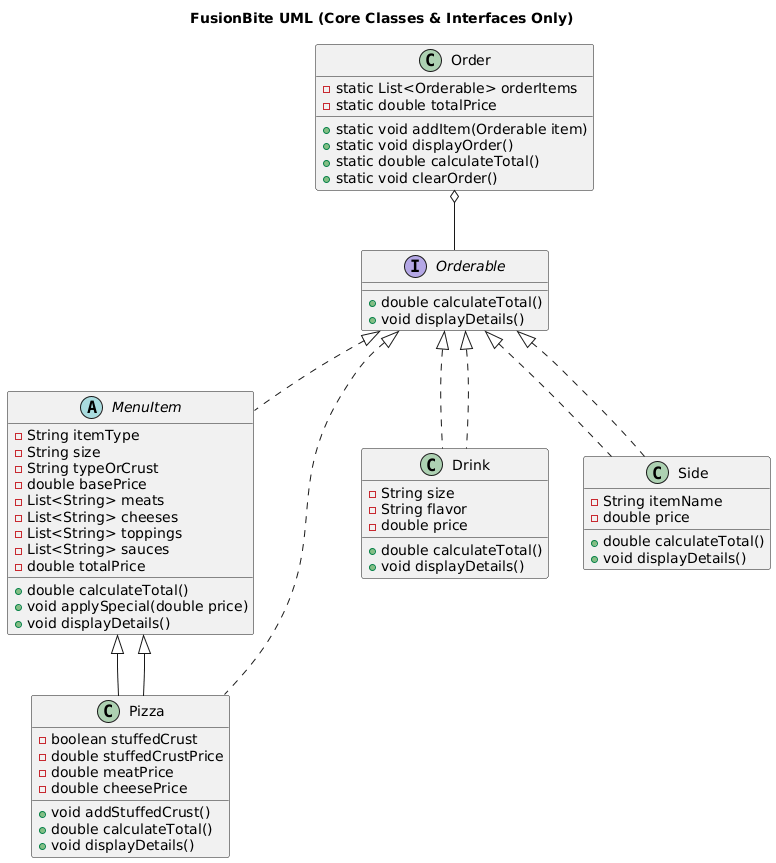
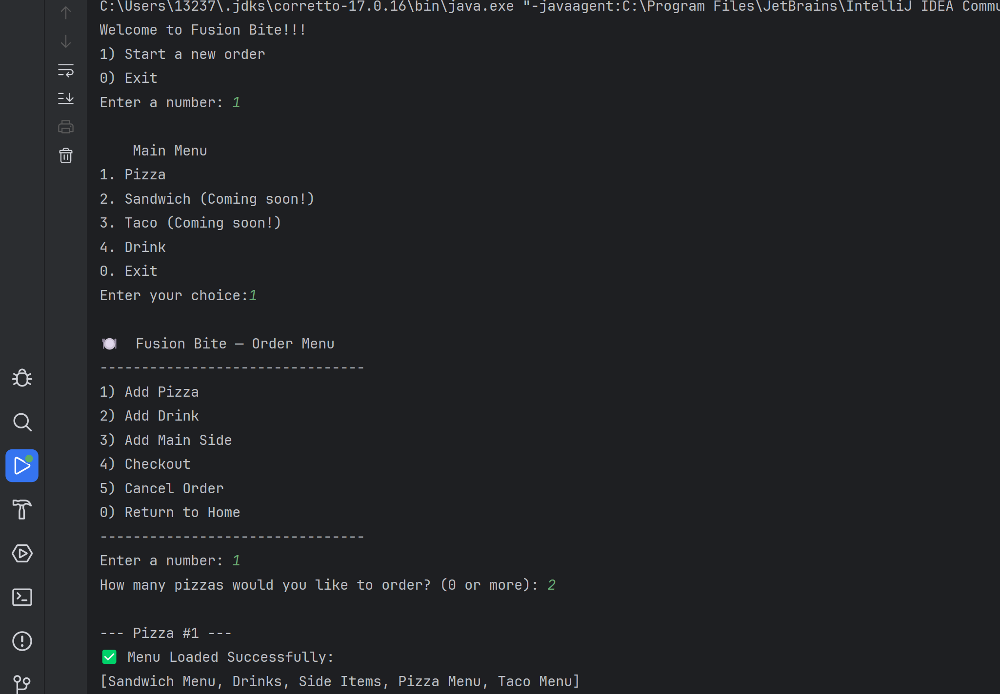
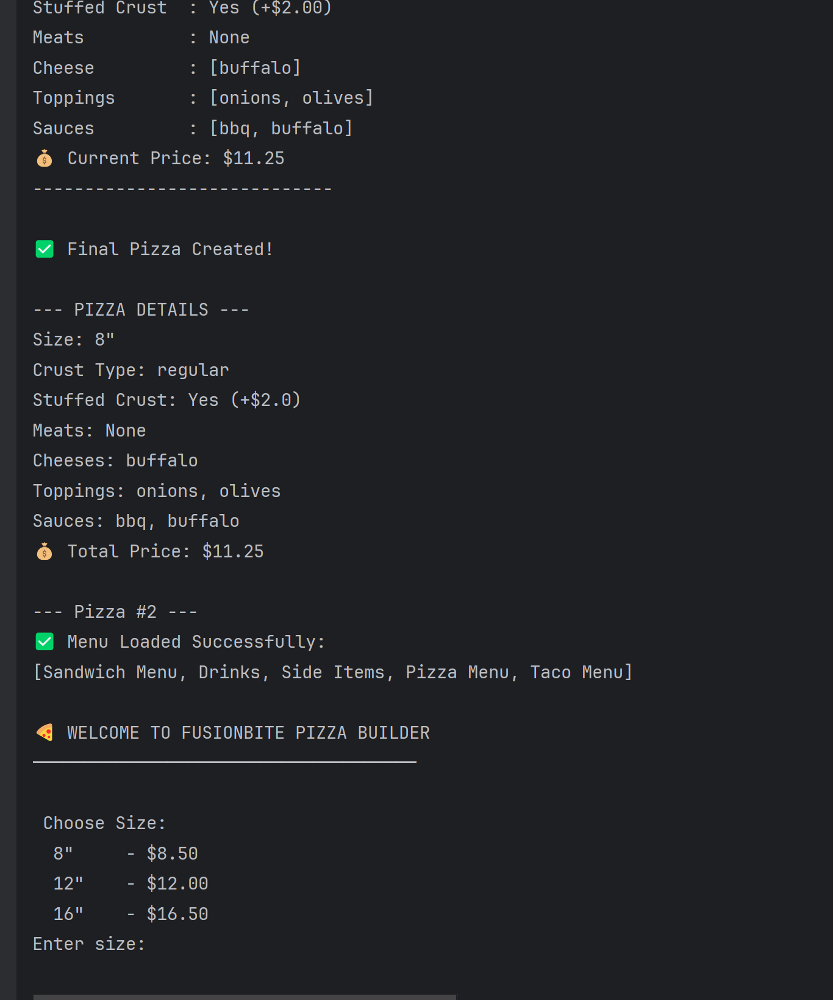
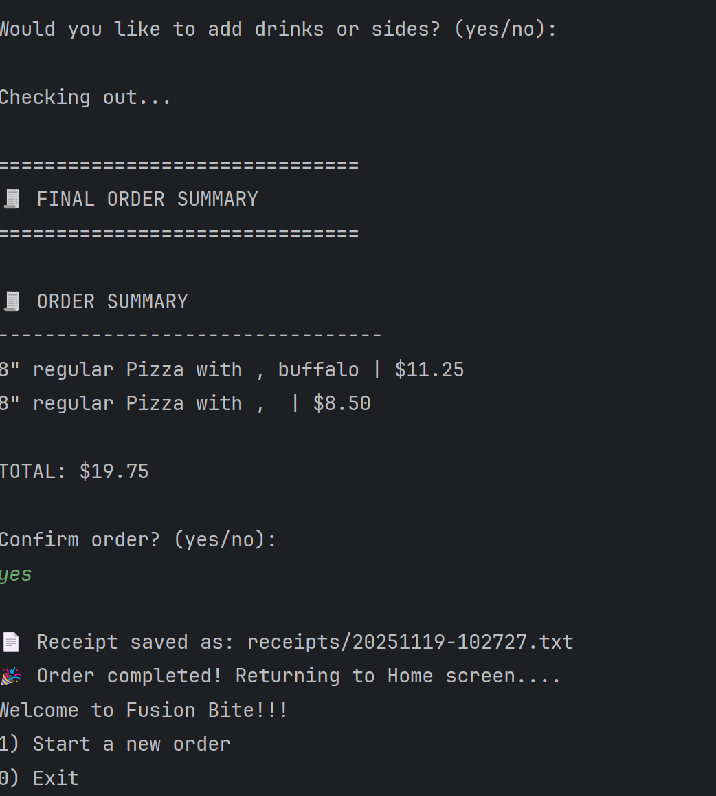

# 🍽️ FusionBite CLI
**Build your custom meal — one choice at a time**

FusionBite is a menu-driven Java console application that lets guests customize pizzas, drinks, and sides. All menu options (toppings, sizes, prices, sauces, etc.) are loaded from a JSON file — meaning you can update the menu without changing any Java code.

This project demonstrates real-world **OOP concepts**, **JSON-driven configuration**, **interfaces**, **polymorphism**, and a clean **console-based user experience**.

---

## 🌟 Features

✔ **Interactive ordering flow** — Start from a clean home menu, choose pizza, drinks, sides, checkout, or cancel anytime  
✔ **Fully customizable pizza builder** — Choose size, crust, sauces, meats, cheeses, toppings, and stuffed crust  
✔ **Data-driven menu** — Everything loads from `menu.json` in real-time  
✔ **Shared order basket (Polymorphism)** — All items (`Pizza`, `Drink`, `Side`) implement `Orderable` and are managed in a single order list  
✔ **Checkout with business rules** — Users **must add a drink or side** if ordering zero pizzas  
✔ **Automatic receipt generation** — On checkout, a timestamped receipt file (e.g., `20251118-233512.txt`) gets saved in `/receipts`  
✔ **Strong OOP architecture** — Interface, encapsulation, inheritance, abstraction, and file I/O

---

## 🗂 Project Structure
```
├── pom.xml                     # Maven build (Java 17, Gson)
├── src/main/java
│   └── com/fusionBite
│       ├── FusionBiteApp.java  # Application entry point
│       ├── menu                # UI flows for pizza, drinks, sides, checkout
│       └── utils               # Menu helpers and console utilities
└── src/main/resources
    └── menu.json               # Editable menu definition used by MenuLoader
```

## Prerequisites
- Java 17 JDK
- Maven 3.9+


## Customizing the menu
All menu options (pizza sizes, crust types, toppings, drink prices, side items) are stored in:
`src/main/resources/menu.json`.To update or extend the menu — you only need to modify this file.
No Java code changes required.

```json
"Side Items": {
  "Chips": 1.50,
  "Garlic Knots": 1.50,
  "Loaded Fries": 2.75,
  "Nachos": 3.50
}
```

## Roadmap & known limitations
- Sandwich and taco flows are still marked as "coming soon" in `MenuUI`.
- test function have not written yet


---

## 💡 Interesting code snippets

### 1. Data-driven pizza builder
```java
public static Pizza buildPizzaOrder() {
    MenuLoader.loadMenuData();
    Map<String, Object> pizzaMenu = MenuLoader.getSection("Pizza Menu");

    String chosenSize = MenuHelper.chooseSize(pizzaMenu, orderDetails);
    Map<String, Object> sizeInfo = ((Map<String, Object>) pizzaMenu.get("sizes")).get(chosenSize);
    double basePrice = ((Number) sizeInfo.get("basePrice")).doubleValue();

    Pizza pizza = new Pizza(chosenSize, "", basePrice,
            ((Number) sizeInfo.get("meatPrice")).doubleValue(),
            ((Number) sizeInfo.get("cheesePrice")).doubleValue());

    displayProgress(orderDetails, pizza.getTotalPrice());
    // ... additional prompts for crust, sauces, toppings, etc.
    return pizza;
}
```
*Shows how every pizza option is read from JSON, letting you reconfigure the builder without touching Java code while keeping a running total for the guest.*

### 2. Enforcing drink/side when skipping pizza
```java
private static void enforceNonPizzaSelection(Scanner scanner) {
    int startingItems = Order.getItemCount();
    while (true) {
        System.out.println("1) Add Drink\n2) Add Main Side\n0) Cancel Order");
        int choice = Utils.readNumber(scanner, "Enter choice: ", Integer.class);
        switch (choice) {
            case 1 -> DrinkUI.drinkScreen();
            case 2 -> sideMenu();
            case 0 -> { System.out.println("No pizzas or extras added."); return; }
            default -> { System.out.println("Invalid selection"); continue; }
        }

        if (Order.getItemCount() > startingItems) {
            System.out.println("Thanks! You added an item so your order can continue.");
            return;
        }
        System.out.println("No items were added. Please add at least one drink or side.");
    }
}
```
*Keeps guests from checking out with zero pizzas by looping until they add a qualifying drink/side or explicitly cancel the order.*

### 3. Shared order basket via polymorphism
```java
public class Order {
    private static final List<Orderable> items = new ArrayList<>();

    public static void addItem(Orderable item) {
        items.add(item);
    }

    public static double calculateTotal() {
        return items.stream().mapToDouble(Orderable::getPrice).sum();
    }

    public static int getItemCount() {
        return items.size();
    }
}
```
*`Pizza`, `Drink`, and `Side` all implement `Orderable`, so the basket doesn’t care which concrete type you add — it just tracks totals and allows validations like the “no empty pizza order” rule.*

---

##  Class structure


## Screenshots





---

## 🧭 Roadmap & known limitations
- Sandwich and taco flows are still marked as "coming soon" in `MenuUI`.
- Test coverage has not been written yet — manual CLI sessions are the best validation for now.

